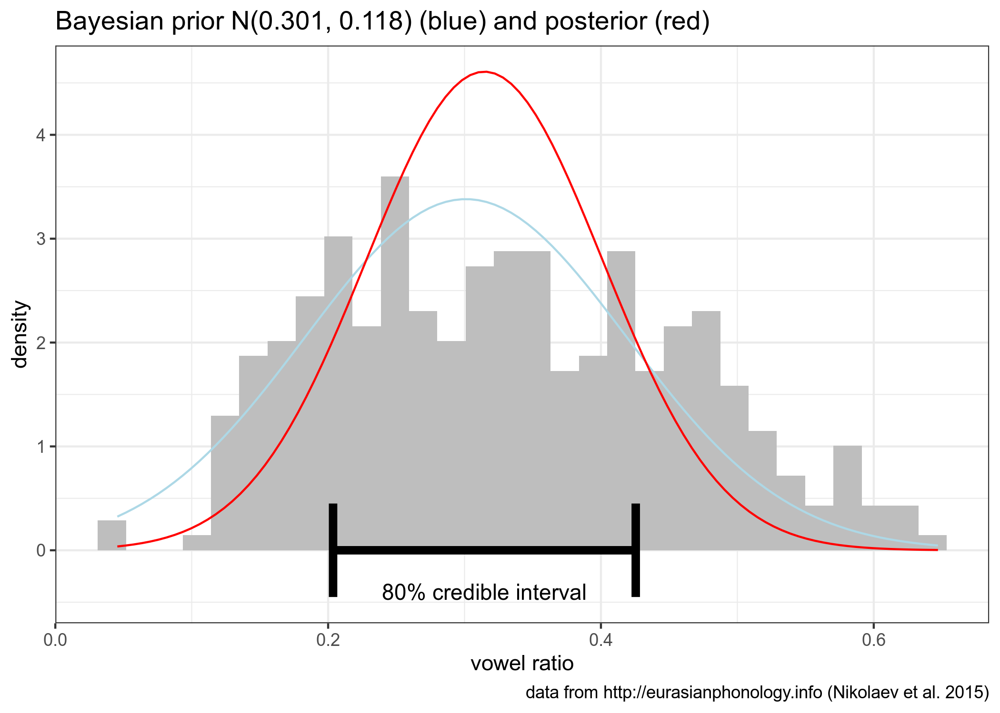

```{r, message=FALSE}
library(tidyverse)
theme_set(theme_bw())
knitr::opts_chunk$set(message = FALSE)
```

## task 2.1 (вес задания: 1)

В датасет `letter_frequency.csv` в вашем репозитории записаны частотности встречаемости букв разных языков согласно Википедии. Вы получили сообщение, содержащее одно слово: "most". Проведите байесовский апдейт, чтобы выяснить на каком языке, согласно модели, написано данное сообщение, исходя из гипотезы, что все языки равновероятны. Посчитайте апостериорную вероятность и выведите в консоль датафрейм, содержащий

* язык с максимальной апостериорной вероятностью;
* само значение апостериорной вероятности.

```{r}
read_csv("letter_frequency.csv") %>% 
  filter(str_detect(letter, "m|o|s|t")) %>% 
  pivot_longer(names_to = "language", values_to = "value", French:Finnish) %>% 
  group_by(language) %>% 
  summarise(likelihood = prod(value),
            prior = 1/13,
            product = likelihood*prior) %>% 
  mutate(posterior = product/sum(product)) %>%
  filter(posterior == max(posterior)) %>% 
  select(language, posterior)
```

или, например, такая реализация

```{r}
letter_freq <- read_csv("letter_frequency.csv")

word <- c("m", "o", "s", "t")

letter_freq %>% 
  filter(letter %in% word) %>% 
  pivot_longer(-letter, names_to = "language", values_to = "value") %>% 
  group_by(language) %>% 
  summarise(likelihood = prod(value),
            prior = 1/length(names(letter_freq)),
            product = likelihood*prior) %>% 
  mutate(posterior = product/sum(product)) %>%
  filter(posterior == max(posterior)) %>% 
  select(language, posterior)
```

можно просто транспонировать датафрейм, но `gather()` и `spread()` считаются устаревшими:

```{r}
read_csv("letter_frequency.csv") %>% 
  filter(letter %in% c("m", "o", "s", "t")) %>% 
  gather(language, value, -letter) %>%
  spread(letter, value) %>% 
  mutate(likelihood = m*o*s*t,
         prior = 1/13,
         product = likelihood*prior,
         posterior = product/sum(product)) %>% 
  filter(posterior == max(posterior)) %>% 
  select(language, posterior)
```

## task 2.2 (вес задания: 2)

В датасете `RNC_verses.csv` в вашем репозитории содержится выборка строчек из стихотворений разных русскоязычных авторов из поэтического подкорпуса НКРЯ (по одной на каждого автора), написанных в 1820 и 1920 годах (данные собрала О. Н. Ляшевская). В переменной `pos` размечена часть речи последнего слова строки. Смоделируйте вероятность появления существительного в конце стихотворения для стихов разных веков, используя априорное бета распределение с параметрами 40 и 40, посчитайте 80% байесовский доверительный интервал и визуализируйте все это на графике (обратите внимание на подписи).


```{r}
df <- read_csv("RNC_verses.csv")


df %>% 
  mutate(pos = ifelse(pos == "NOUN", "NOUN", "OTHER")) %>% 
  count(decade, pos) %>% 
  pivot_wider(names_from = pos, values_from = n) %>% 
  mutate(post_a = NOUN + 40,
         post_b = OTHER + 40) ->
  res

ggplot()+
  stat_function(fun = dbeta, args = c(res$post_a[1], res$post_b[1]), color = "red", n = 1000)+
  stat_function(fun = dbeta, args = c(res$post_a[2], res$post_b[2]), color = "lightblue", n = 1000)+
  annotate(geom = "errorbar", y = -0.5, 
           xmin = qbeta(0.1, res$post_a[1], res$post_b[1]),
           xmax = qbeta(0.9, res$post_a[1], res$post_b[1]), color = "red")+
  annotate(geom = "errorbar", y = -1.5, 
            xmin = qbeta(0.1, res$post_a[2], res$post_b[2]),
           xmax = qbeta(0.9, res$post_a[2], res$post_b[2]), color = "lightblue")+
  xlim(0, 1)+
  labs(x = "ratio of nouns in the end of verse line",
       title = "Bayesian posterior beta distribution of poetry samples from 1820s (red) and 1920s (blue)",
       caption = "data from  from the subcorpus of Russian Poetry in RNC",
       subtitle = "prior distribution is a beta with both parametres equal 40; errorbars represent 80% credible intervals")
```

## task 2.3 (вес задания: 2)

В датасет `eurasianphonology.csv` в вашем репозитории записаны агрегированные данные из базы данных фонологических систем Евразии <http://eurasianphonology.info> (Nikolaev et al. 2015). Смоделируйте распределение доли гласных из всех сегментов нормальным распределением с априорным нормальным распределением со средним = 0.301 и стандартным отклонением = 0.118, посчитайте 80% байесовский доверительный интервал и визуализируйте все это на графике (обратите внимание на подписи).



```{r}
read_csv("eurasianphonology.csv") %>% 
  pivot_wider(names_from = segment_type, values_from = n) %>% 
  mutate(ratio = vowel/(vowel+consonant)) ->
  res

sd_prior <- 0.118
sd_data <- sd(res$ratio)
sd_post <- 1/sqrt(1/sd_prior^2 + 1/sd_data^2)
mean_prior <- 0.301
mean_data <- mean(res$ratio)
mean_post <- weighted.mean(c(mean_prior, mean_data), c(1/sd_prior^2, 1/sd_data^2))

cred_int_l <- qnorm(0.1, mean_post, sd_post)
cred_int_h <- qnorm(0.9, mean_post, sd_post)

res %>% 
  ggplot(aes(ratio)) +
  geom_histogram(aes(y = ..density..), fill = "grey")+
  stat_function(fun = dnorm, args = list(mean_prior,  sd_prior), color = "lightblue")+
  stat_function(fun = dnorm, args = list(mean_post,  sd_post), color = "red")+
  annotate(geom = "errorbar", y = 0, xmin = cred_int_l, xmax = cred_int_h, size = 2)+
  annotate(geom = "text", y = -0.4, x = mean_post, label = "80% credible interval")+
  labs(x = "vowel ratio",
       caption = "data from http://eurasianphonology.info (Nikolaev et al. 2015)",
       title = "Bayesian prior N(0.301, 0.118) (blue) and posterior (red)")
```

## task 2.4 (вес задания: 1)

Приведите ниже аргумент(ы) за/против модели в задании 2.3.

* Доля $\in [0, 1]$, а нормальное распределение $\in [-\infty, +\infty]$, хотя и на невероятные значения остается лишь чуть больше одной десятитысячной:

```{r}
1 - integrate(dnorm, lower = 0, upper = 1, mean = mean_post, sd = sd_post)$value
```

* В данной модели мы предполагаем, что все наблюдения не зависят друг от друга, однако в действительности, в датасете представлены достаточно много родственных языков, таким образом в данных есть внутренние группировки, которые бы в идеале стоило бы учитывать.

## task 2.5 (вес задания: 1)

Место для рефлексии по поводу ответов. Заполняется после того, как присланы ответы на задания до 08.03.2021 23:59. Это оцениваемое задание.
